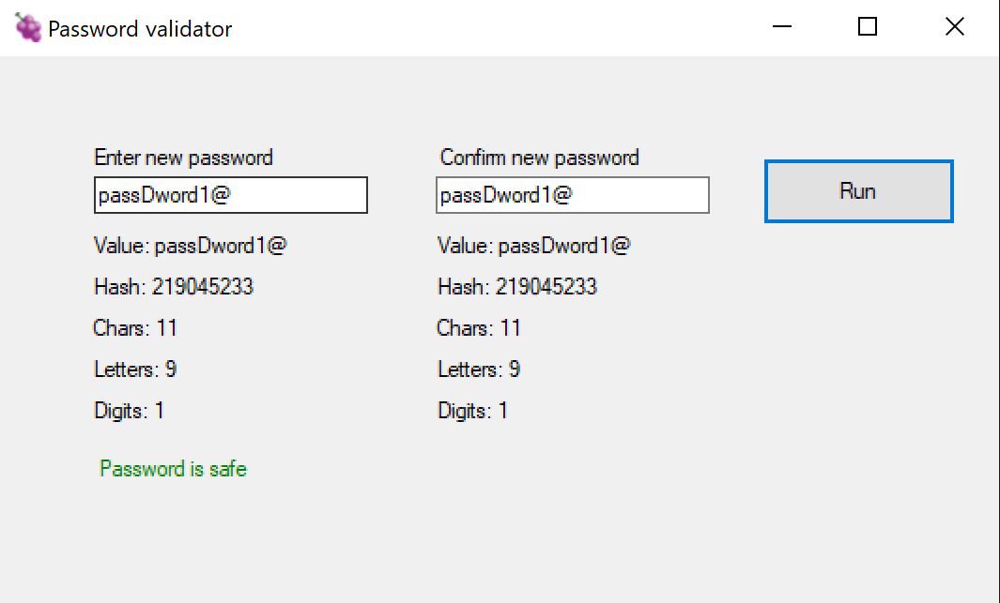
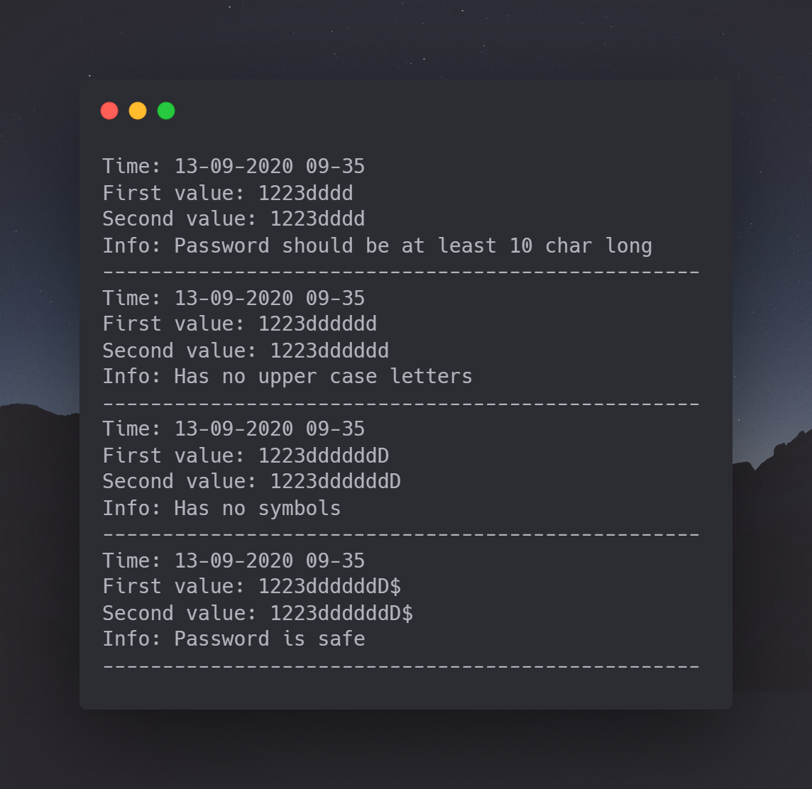

# Password validator

## About

Small application made in C# to validate password.

For successful validation the application expects to:
* Have the same value in both text boxes
* Be at least 10 characters long
* Not have any whitespaces
* Have at least one lower case letter
* Have at least one upper case letter
* Have at least one digit

## Logging

After every validation attempt a log file is made under
`C:\Log`

Example:

